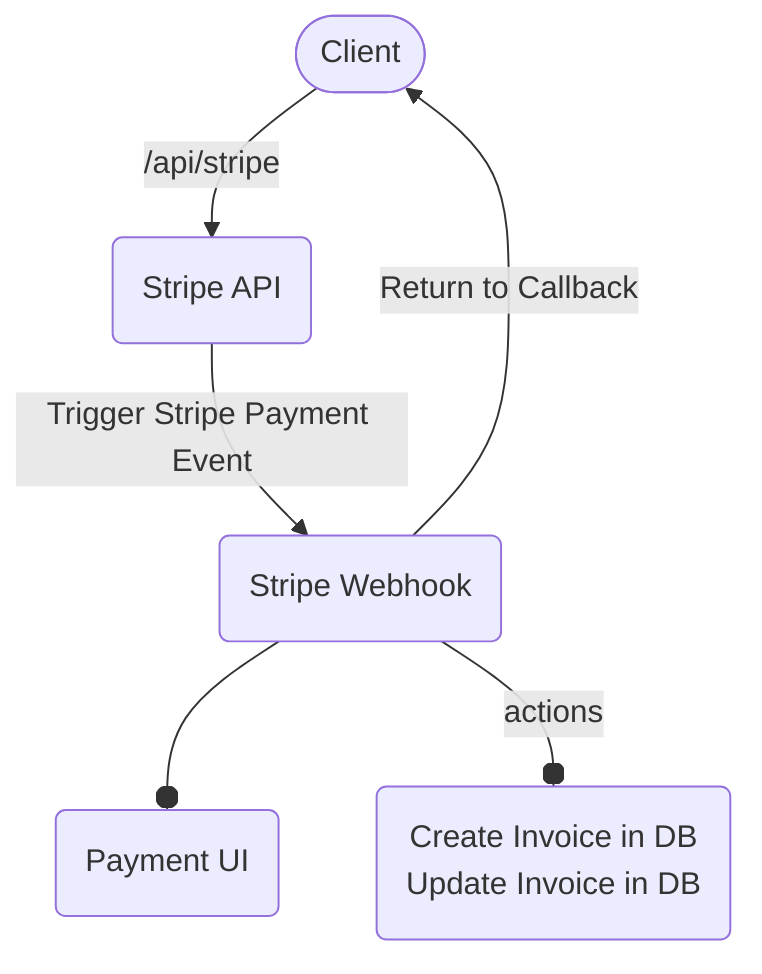

# How to use the stripe payment API
For you to effectively use the stripe payment api I developed, you first need to know some few things. Let's first start with the architecture to understand how things flow in our program. We can then proceed to look at the endpoints, middlewares and how to use the provided endpoint.

## Stripe Payment Architecture

Let's now look at each component in the diagram above and provided an implementation for each. At the end we will rap everything together to make it functional

## Stripe API
```javascript
// file path: ./src/stripe/StripeRouter
const express = require("express");
const StripeService = require("./StripeService");

const router = express.Router();

router.post("/api/stripe", 
    check("email")
        .notEmpty()
        .withMessage("Email cannot be empty")
        .bail()
        .isEmail()
        .withMessage("Email is invalid"),
    async(req, res) => {
        const errors = validationResult(req);
        if (!errors.isEmpty()) {
            return res.send({message: "Input error messages"}).status(401)
        }

        try {
            const {email} = req.body;
            const stripeSession = await StripeService.create(email);
            return res.send({ url: stripeSession.url });
        } catch(error) {
            console.log("[STRIPE_ERROR]", error);
        }

    }
)
```

```javascript
// file path: ./src/stripe/StripeService
const create = async (email) => {
    const stripeSession = await stripe.checkout.sessions.create({
        success_url: "/johnson",
        cancel_url: "/johnson",
        payment_method_types: ["card"],
        mode: "",
        billing_address_collection: "auto",
        customer_email: email,
        line_items: [
            {
                price_data: {
                    currency: "USD",
                    product_data: {
                        name: "Johnson Donation Platform",
                        description: "Donate to support children",
                    },
                    unit_amount: 500,
                    recurring: {},
                },
                quantity: undefined,
            }
        ],
        metadata: {
            email,
        }
    })

    return stripeSession
}

module.exports = {
    create
}
```

## Stripe Webhook
```javascript
const express = require("express");
import Stripe from "stripe";
import { headers } from "express-header";
import db from "./src/config/db";
import { stripe } from "./src/config/stripe";

const router = express.Router();

router.post("/api/webhook", async (req, res) => {
    const body = await req.text();
    const signature = headers().get("Stripe-Signature") as string;

    let event: Stripe.Event;

    try {
        // UI generated here
        event = stripe.webhooks.constructEvent(
            body,
            signature,
            process.env.STRIPE_WEBHOOK_SECRET!
        );
    } catch (error) {
        return res.send({error: `Webhook Error: ${error.message}`}).status(400);
    }

    const session = event.data.object as Stripe.Checkout.Session;

    if (event.type === "checkout.session.completed") {
        const subscription = await stripe.subscriptions.retrieve(
            session.subscription as string
        );

        if (!session?.metadata?.email) {
            return res.send(msg: "User email is required").status(400);
        }

        await db.userSubscription.create({
            data: {
                userEmail: session?.metadata?.email,
                stripeSubscriptionId: subscription.id,
                stripeCustomerId: subscription.customer as string,
                stripePriceId: subscription.items.data[0].price.id,
            }
        });
    }

    if (event.type === "invoice.payment_succeeded") {
        const subscription = await stripe.subscriptions.retrieve(
            session.subscription as string
        );

        await db.userSubscription.update({
            where: {
                stripeSubscriptionId: subscription.id,
            },
            data: {
                stripePriceId: subscription.items.data[0].price.id,
            }
        })
    }
})
```