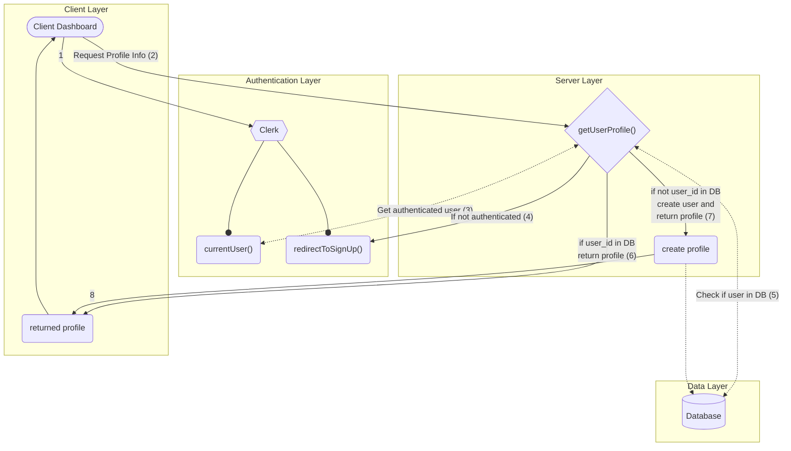

# VPASS USER AUTHENTICATION DIAGRAM
## What is authentication?
Authentication is used by a server when the server needs to know exactly who is accessing their information or site. In authentication, ther user or computer has to prove its identity to the server or client.

## VPASS Authentication Diagram


## Sign In to VERSITECH PLATFORM
When a user signs-in to the VERSITECH platform, we authomatically have access to their user profile information from the authentication provider.
If using clerk for authentication, we are provided with two api's which will enable us get the currentUser and if that user does not exist we redirect to the sign-up page so they can sign-in.
The two api's can be accessed as follows
```javascript
import { currentUser, redirectToSignIn } from "@clerk/nextjs"
```

## Fetch Profile Information
After user is logged-in using clerk, we can make api calls to get the currentUser, create a profile for that user in our database if user does not exist or return profile information if in database. This kind of operation will be done when user visits the dashboard page.

```javascript
// file name: ./lib/initial-profile.ts

import { currentUser, redirectToSignIn } from "@clerk/nextjs";
import { currentProfile } from "@lib/current-profile";
import { db } from "@lib/db";

export getUserProfile = async () => {
    const user = await currentUser();

    if (!user) {
        return redirectToSignIn();
    }

    const profile = await db.profile.findUnique({
        where: {
            userId: user.id
        }
    })

    if (profile) {
        return profile;
    }

    const newProfile = await db.profile.create({
        data: {
            userId: user.id,
            name: `${user.firstName} ${user.lastName}`,
            imageUrl: user.imageUrl,
            email: user.emailAdresses[0].emailAddress,
        },
    });

    return newProfile;
}
```