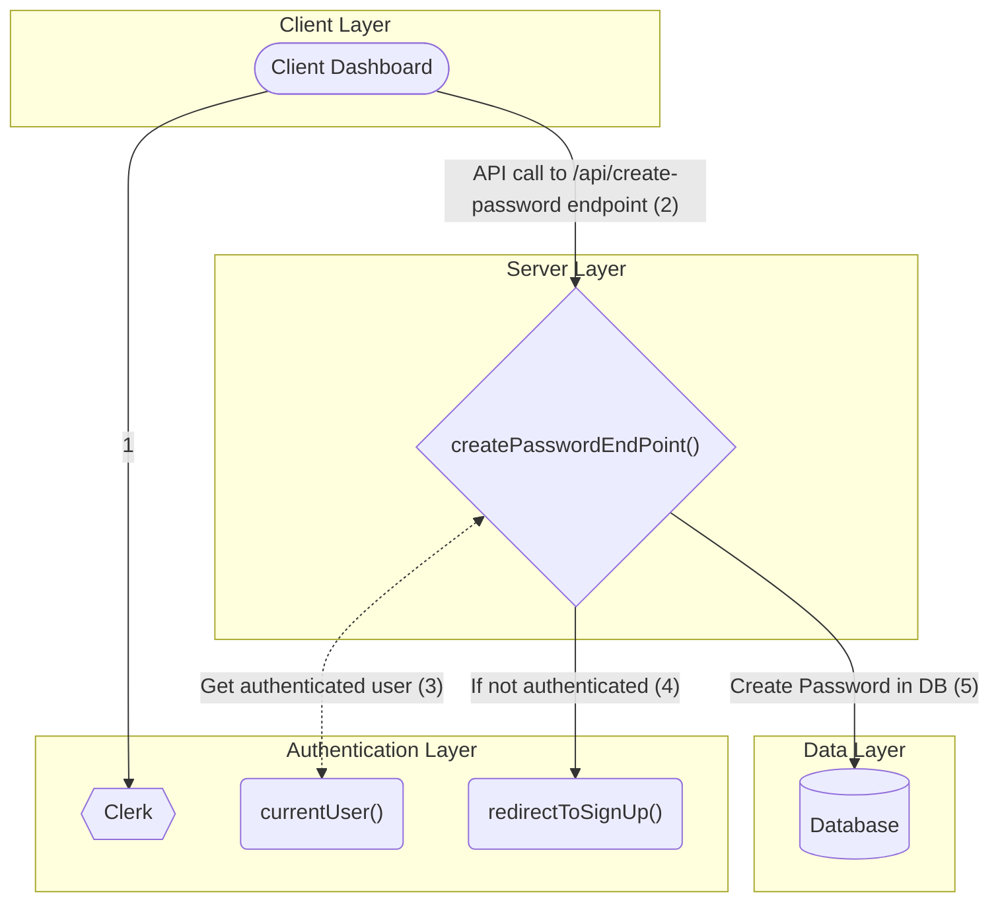

# VPASS CREATE PASSWORD DIAGRAM
## Authentication
Creating Passwords in VPASS requires that the user is authenticated by the VPASS system before user is authorized to make any changes to reflect in the database

## Password Creation Flow Diagram


## Create Password API Endpoint
```javascript
import { NextResponse } from "next/server";

import { currentProfile } from "@/lib/current-profile";
import { db } from "@/lib/db";

export async function POST(req: Request, { params }: { params: { userId } }) {
    try {
        const profile = await currentProfile();
        const { description, password } = await req.json()

        if (!profile) {
            return new NextResponse("Unauthorized", { status: 401 });
        }

        if (!params.userId) {
            return new NextResponse("User ID Missing", { status: 400 });
        }

        const password = await.db.password.create({
            data: {
                profileId: profile.id,
                description,
                password 
            }
        })

        return NextResponse.json({ msg: "Password created, successfully" });
    }
}
```

## Fetch Passwords
To fetch the passwords, we need to first get the currentUser from clerk and if user exist, we make a call to the database to get all the passwords relating to this particular user. *(This is a good point to implement pagination when the number passwords are a lot)*

We can first make a modular function which is going to help us with the fetching of the current user as shown below.
```javascript
// filename: ./lib/current-profile.ts
import { auth } from "@clerk/nextjs";
import { db } from "@/lib/db";

export const currentProfile = async () => {
    const { userId } = auth();

    if (!userId) {
        return null;
    }

    const profile = await db.profile.findUnique({
        where: {
            userId,
        },
    });

    return profile;
}
```

Now that we have the modular function above, we can then create a getPasswords() api which will enable us get all passwords of the user when they visit their dashboard.
```javascript
import { redirectToSignIn } from "@clerk/nextjs"
import { currentProfile } from "@/lib/current-profile";
import { db } from "@lib/db"

export const getPasswords = async () => {
    const profile = await currentProfile();

    if (!profile) {
        return redirectToSignIn();
    }

    const passwords = await db.password.find({
        where: {
            profileId: profile.id
        },
        include: {
            description,
            createdAt
        }
    })


    return (
        // React components
        // This is the dashboard page
        // Pass the passwords object to it to render
    )

}
```