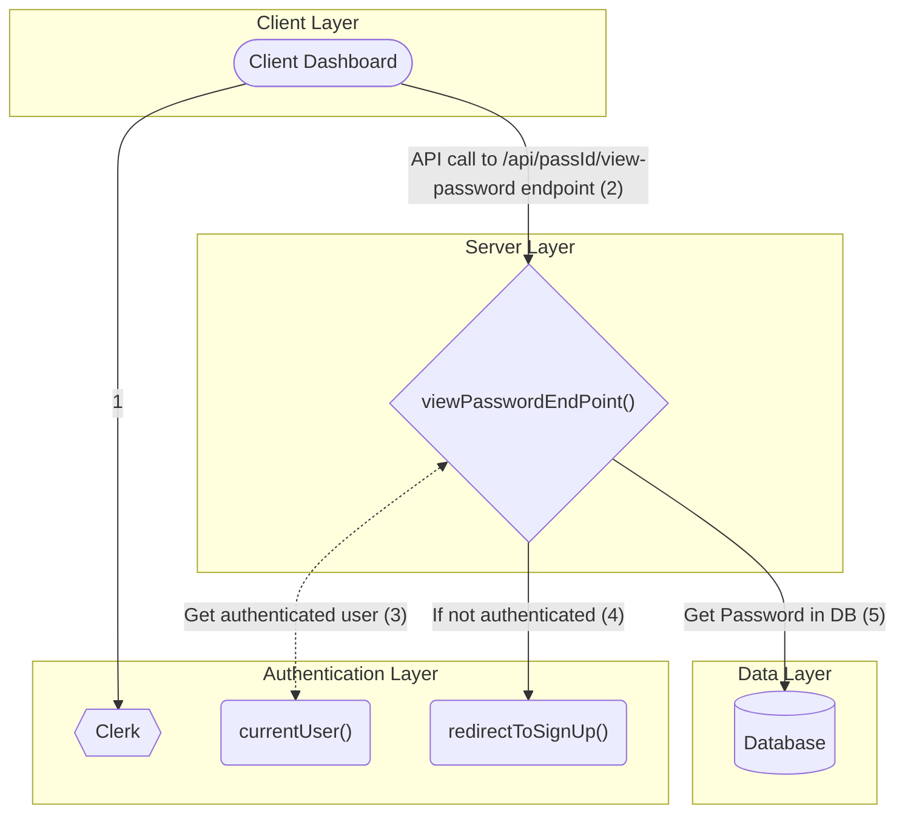

# VPASS VIEW PASSWORD DIAGRAM
## Authentication
In the process of viewing passwords as well, users need to be authenticated.

## View Password Flow Diagram


## View Password API Endpoint
```javascript
import { NextResponse } from "next/server";

import { currentProfile } from "@/lib/current-profile";
import { db } from "@/lib/db";

export async function GET(req: Request, { params }: { params: { userId, passId } }) {
    try {
        const profile = await currentProfile();

        if (!profile) {
            return new NextResponse("Unauthorized", { status: 401 });
        }

        if (!params.userId) {
            return new NextResponse("User ID Missing", { status: 400 });
        }

        if (!params.passId) {
            return new NextResponse("Password ID Missing", { status: 400 });
        }

        const password = await.db.password.findUnique({
            where: {
                id: params.passId,
                profileId: params.userId
            },
            include: {
                description,
                password,
                createdAt
            }
        })

        return NextResponse.json(password);
    }
}
```